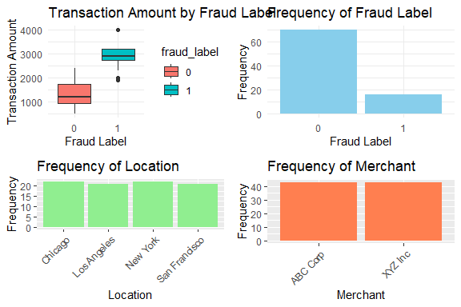

Bank Fraud Prediction
================
Trevor Okinda
2024

- [Student Details](#student-details)
- [Setup Chunk](#setup-chunk)
  - [Source:](#source)
  - [Reference:](#reference)
- [Understanding the Dataset (Exploratory Data Analysis
  (EDA))](#understanding-the-dataset-exploratory-data-analysis-eda)
  - [Loading the Dataset](#loading-the-dataset)
  - [Measures of Distribution](#measures-of-distribution)
  - [Measures of Relationship](#measures-of-relationship)
  - [ANOVA](#anova)
  - [Plots](#plots)
- [Preprocessing & Data Prediction](#preprocessing--data-prediction)
  - [Missing Values](#missing-values)
- [Training Different Models](#training-different-models)
  - [Data Splitting](#data-splitting)
  - [Bootstrapping](#bootstrapping)
  - [Cross-validation](#cross-validation)
  - [Training Different Models](#training-different-models-1)
  - [Performance Comparison](#performance-comparison)
  - [Saving Model](#saving-model)

# Student Details

|                       |                       |
|-----------------------|-----------------------|
| **Student ID Number** | 134780                |
| **Student Name**      | Trevor Okinda         |
| **BBIT 4.2 Group**    | C                     |
| **Project Name**      | Bank Fraud Prediction |

# Setup Chunk

**Note:** the following KnitR options have been set as the global
defaults: <BR>
`knitr::opts_chunk$set(echo = TRUE, warning = FALSE, eval = TRUE, collapse = FALSE, tidy = TRUE)`.

More KnitR options are documented here
<https://bookdown.org/yihui/rmarkdown-cookbook/chunk-options.html> and
here <https://yihui.org/knitr/options/>.

### Source:

The dataset that was used can be downloaded here:
*\<<a href="https://www.kaggle.com/datasets/sauravmishraa/frauddataset\"
class="uri">https://www.kaggle.com/datasets/sauravmishraa/frauddataset\</a>\>*

### Reference:

*\<Mishra, S. (n.d.). Bank Fraud Dataset \[Data set\]. Kaggle.
<a href="https://www.kaggle.com/datasets/sauravmishraa/frauddataset\"
class="uri">https://www.kaggle.com/datasets/sauravmishraa/frauddataset\</a>\>  
Refer to the APA 7th edition manual for rules on how to cite datasets:
<https://apastyle.apa.org/style-grammar-guidelines/references/examples/data-set-references>*

# Understanding the Dataset (Exploratory Data Analysis (EDA))

## Loading the Dataset

``` r
# Load dataset
bank_data <- read.csv("fraud_dataset.csv", colClasses = c(
  transaction_id = "integer",
  transaction_amount = "numeric",
  location = "factor",
  merchant = "factor",
  age = "numeric",
  gender = "factor",
  fraud_label = "factor"
))

# Display the structure of the dataset
str(bank_data)
```

    ## 'data.frame':    86 obs. of  7 variables:
    ##  $ transaction_id    : int  1 2 3 4 5 6 7 8 9 10 ...
    ##  $ transaction_amount: num  1000 500 2000 1500 800 3000 1200 900 2500 1800 ...
    ##  $ location          : Factor w/ 4 levels "Chicago","Los Angeles",..: 3 1 2 4 1 3 4 2 1 3 ...
    ##  $ merchant          : Factor w/ 2 levels "ABC Corp","XYZ Inc": 1 2 1 2 1 2 1 2 1 2 ...
    ##  $ age               : num  35 45 28 30 50 42 55 37 33 48 ...
    ##  $ gender            : Factor w/ 2 levels "F","M": 2 1 2 1 1 2 1 2 1 2 ...
    ##  $ fraud_label       : Factor w/ 2 levels "0","1": 1 1 2 1 1 2 1 1 2 1 ...

``` r
# View the first few rows of the dataset
head(bank_data)
```

    ##   transaction_id transaction_amount      location merchant age gender
    ## 1              1               1000      New York ABC Corp  35      M
    ## 2              2                500       Chicago  XYZ Inc  45      F
    ## 3              3               2000   Los Angeles ABC Corp  28      M
    ## 4              4               1500 San Francisco  XYZ Inc  30      F
    ## 5              5                800       Chicago ABC Corp  50      F
    ## 6              6               3000      New York  XYZ Inc  42      M
    ##   fraud_label
    ## 1           0
    ## 2           0
    ## 3           1
    ## 4           0
    ## 5           0
    ## 6           1

``` r
# View the dataset in a separate viewer window
View(bank_data)
```

## Measures of Distribution

``` r
# Calculate measures of distribution for numerical variables
range_transaction_amount <- range(bank_data$transaction_amount)
variance_transaction_amount <- var(bank_data$transaction_amount)
standard_deviation_transaction_amount <- sd(bank_data$transaction_amount)

range_age <- range(bank_data$age)
variance_age <- var(bank_data$age)
standard_deviation_age <- sd(bank_data$age)

# Print measures of distribution
print("Measures of Distribution for Transaction Amount:")
```

    ## [1] "Measures of Distribution for Transaction Amount:"

``` r
print(paste("Range:", range_transaction_amount[2] - range_transaction_amount[1]))
```

    ## [1] "Range: 3500"

``` r
print(paste("Variance:", variance_transaction_amount))
```

    ## [1] "Variance: 638714.271545828"

``` r
print(paste("Standard Deviation:", standard_deviation_transaction_amount))
```

    ## [1] "Standard Deviation: 799.196015721943"

``` r
print("Measures of Distribution for Age:")
```

    ## [1] "Measures of Distribution for Age:"

``` r
print(paste("Range:", range_age[2] - range_age[1]))
```

    ## [1] "Range: 30"

``` r
print(paste("Variance:", variance_age))
```

    ## [1] "Variance: 77.9580027359781"

``` r
print(paste("Standard Deviation:", standard_deviation_age))
```

    ## [1] "Standard Deviation: 8.82938291931991"

## Measures of Relationship

``` r
# Calculate correlation coefficient for numerical variables
correlation_matrix <- cor(bank_data[c("transaction_amount", "age")])

# Print correlation matrix
print("Correlation Matrix:")
```

    ## [1] "Correlation Matrix:"

``` r
print(correlation_matrix)
```

    ##                    transaction_amount         age
    ## transaction_amount         1.00000000 -0.09658974
    ## age                       -0.09658974  1.00000000

``` r
# Create contingency tables for categorical variables
contingency_location_fraud_label <- table(bank_data$location, bank_data$fraud_label)
contingency_merchant_fraud_label <- table(bank_data$merchant, bank_data$fraud_label)
contingency_gender_fraud_label <- table(bank_data$gender, bank_data$fraud_label)

# Print contingency tables
print("Contingency Table: Location vs. Fraud Label")
```

    ## [1] "Contingency Table: Location vs. Fraud Label"

``` r
print(contingency_location_fraud_label)
```

    ##                
    ##                  0  1
    ##   Chicago       16  6
    ##   Los Angeles   20  1
    ##   New York      21  1
    ##   San Francisco 13  8

``` r
print("Contingency Table: Merchant vs. Fraud Label")
```

    ## [1] "Contingency Table: Merchant vs. Fraud Label"

``` r
print(contingency_merchant_fraud_label)
```

    ##           
    ##             0  1
    ##   ABC Corp 33 10
    ##   XYZ Inc  37  6

``` r
print("Contingency Table: Gender vs. Fraud Label")
```

    ## [1] "Contingency Table: Gender vs. Fraud Label"

``` r
print(contingency_gender_fraud_label)
```

    ##    
    ##      0  1
    ##   F 34  9
    ##   M 36  7

## ANOVA

``` r
# Load necessary libraries (if not already loaded)
library(stats)

# Perform ANOVA
anova_result <- aov(transaction_amount ~ location, data = bank_data)

# Print ANOVA results
print(summary(anova_result))
```

    ##             Df   Sum Sq Mean Sq F value   Pr(>F)    
    ## location     3 11242491 3747497   7.138 0.000256 ***
    ## Residuals   82 43048222  524978                     
    ## ---
    ## Signif. codes:  0 '***' 0.001 '**' 0.01 '*' 0.05 '.' 0.1 ' ' 1

## Plots

``` r
# Load necessary libraries
library(ggplot2)
library(gridExtra)

# Univariate Plot: Transaction Amount
univariate_plot_transaction_amount <- ggplot(bank_data, aes(x = transaction_amount)) +
  geom_histogram(binwidth = 1000, fill = "skyblue", color = "black") +
  labs(title = "Distribution of Transaction Amount", x = "Transaction Amount", y = "Frequency")

# Univariate Plot: Age
univariate_plot_age <- ggplot(bank_data, aes(x = age)) +
  geom_histogram(binwidth = 5, fill = "lightgreen", color = "black") +
  labs(title = "Distribution of Age", x = "Age", y = "Frequency")

# Multivariate Plot: Transaction Amount vs. Age
multivariate_plot <- ggplot(bank_data, aes(x = transaction_amount, y = age)) +
  geom_point(alpha = 0.5, color = "blue") +
  labs(title = "Transaction Amount vs. Age", x = "Transaction Amount", y = "Age")

# Display plots in R
grid.arrange(univariate_plot_transaction_amount, univariate_plot_age, multivariate_plot, ncol = 2, nrow = 2)
```

<!-- -->

``` r
# Boxplot: Transaction Amount by Fraud Label
boxplot_transaction_amount_fraud_label <- ggplot(bank_data, aes(x = fraud_label, y = transaction_amount, fill = fraud_label)) +
  geom_boxplot() +
  labs(title = "Transaction Amount by Fraud Label", x = "Fraud Label", y = "Transaction Amount") +
  theme_minimal()

# Barplot: Frequency of Fraud Label
barplot_fraud_label <- ggplot(bank_data, aes(x = factor(fraud_label))) +
  geom_bar(fill = "skyblue") +
  labs(title = "Frequency of Fraud Label", x = "Fraud Label", y = "Frequency") +
  theme_minimal()

# Barplot: Frequency of Location
barplot_location <- ggplot(bank_data, aes(x = location)) +
  geom_bar(fill = "lightgreen") +
  labs(title = "Frequency of Location", x = "Location", y = "Frequency") +
  theme(axis.text.x = element_text(angle = 45, hjust = 1))

# Barplot: Frequency of Merchant
barplot_merchant <- ggplot(bank_data, aes(x = merchant)) +
  geom_bar(fill = "coral") +
  labs(title = "Frequency of Merchant", x = "Merchant", y = "Frequency") +
  theme(axis.text.x = element_text(angle = 45, hjust = 1))

# Display plots in R
grid.arrange(boxplot_transaction_amount_fraud_label, barplot_fraud_label, barplot_location, barplot_merchant, ncol = 2, nrow = 2)
```

<!-- -->

# Preprocessing & Data Prediction

## Missing Values

``` r
# Check for missing values
missing_values <- sum(is.na(bank_data))

# Display summary of missing values
print(paste("Number of missing values:", missing_values))
```

    ## [1] "Number of missing values: 0"

``` r
# Summary of missing values by column
print(summary(is.na(bank_data)))
```

    ##  transaction_id  transaction_amount  location        merchant      
    ##  Mode :logical   Mode :logical      Mode :logical   Mode :logical  
    ##  FALSE:86        FALSE:86           FALSE:86        FALSE:86       
    ##     age            gender        fraud_label    
    ##  Mode :logical   Mode :logical   Mode :logical  
    ##  FALSE:86        FALSE:86        FALSE:86

# Training Different Models

## Data Splitting

``` r
# Load necessary library
library(caTools)

# Set seed for reproducibility
set.seed(123)

# Split data into training and testing sets (70% training, 30% testing)
split <- sample.split(bank_data$fraud_label, SplitRatio = 0.7)
train_data <- subset(bank_data, split == TRUE)
test_data <- subset(bank_data, split == FALSE)

# Print dimensions of training and testing sets
print("Dimensions of Training Data:")
```

    ## [1] "Dimensions of Training Data:"

``` r
print(dim(train_data))
```

    ## [1] 60  7

``` r
print("Dimensions of Testing Data:")
```

    ## [1] "Dimensions of Testing Data:"

``` r
print(dim(test_data))
```

    ## [1] 26  7

## Bootstrapping

``` r
library(boot)

# Define the number of bootstrap samples
num_bootstraps <- 1000

# Initialize a vector to store bootstrap statistics
bootstrap_statistics <- numeric(num_bootstraps)

# Set seed for reproducibility
set.seed(123)

# Perform bootstrapping
for (i in 1:num_bootstraps) {
  # Sample with replacement from the dataset
  bootstrap_sample <- bank_data[sample(nrow(bank_data), replace = TRUE), ]
  
  # Calculate the statistic of interest (e.g., mean transaction amount)
  # For example, let's calculate the mean transaction amount for each bootstrap sample
  bootstrap_statistics[i] <- mean(bootstrap_sample$transaction_amount)
}

# Calculate confidence interval (e.g., 95% confidence interval)
confidence_interval <- quantile(bootstrap_statistics, c(0.025, 0.975))

# Print confidence interval
print("95% Confidence Interval for Mean Transaction Amount:")
```

    ## [1] "95% Confidence Interval for Mean Transaction Amount:"

``` r
print(confidence_interval)
```

    ##     2.5%    97.5% 
    ## 1464.481 1777.865

## Cross-validation

``` r
# Load necessary library
library(caret)
```

    ## Loading required package: lattice

    ## 
    ## Attaching package: 'lattice'

    ## The following object is masked from 'package:boot':
    ## 
    ##     melanoma

``` r
# Define the number of folds
num_folds <- 5  # You can adjust this as needed

# Set seed for reproducibility
set.seed(123)

# Create the training control object for k-fold cross-validation
train_control <- trainControl(method = "cv", number = num_folds)

# Define the model (e.g., logistic regression)
model <- train(
  fraud_label ~ .,  # Adjust the formula as needed
  data = bank_data,
  method = "glm",  # Adjust the method as needed (e.g., "glm", "rf", "gbm")
  trControl = train_control
)

# Print the cross-validation results
print(model)
```

    ## Generalized Linear Model 
    ## 
    ## 86 samples
    ##  6 predictor
    ##  2 classes: '0', '1' 
    ## 
    ## No pre-processing
    ## Resampling: Cross-Validated (5 fold) 
    ## Summary of sample sizes: 69, 68, 69, 69, 69 
    ## Resampling results:
    ## 
    ##   Accuracy   Kappa    
    ##   0.9078431  0.7109563

## Training Different Models

``` r
# Load necessary libraries
library(caret)

# Set seed for reproducibility
set.seed(123)

# Define the training control object for model training
train_control <- trainControl(method = "cv", number = 5)

# Logistic Regression Model
logistic_model <- train(
  fraud_label ~ ., 
  data = bank_data, 
  method = "glm", 
  trControl = train_control
)

# Decision Trees Model
decision_trees_model <- train(
  fraud_label ~ ., 
  data = bank_data, 
  method = "rpart", 
  trControl = train_control
)

# Random Forest Model
random_forest_model <- train(
  fraud_label ~ ., 
  data = bank_data, 
  method = "rf", 
  trControl = train_control
)

# Gradient Boosting Machines (GBMs) Model
gbm_model <- train(
  fraud_label ~ ., 
  data = bank_data, 
  method = "gbm", 
  trControl = train_control
)
```

    ## Iter   TrainDeviance   ValidDeviance   StepSize   Improve
    ##      1        0.8410             nan     0.1000    0.0334
    ##      2        0.7765             nan     0.1000    0.0335
    ##      3        0.7467             nan     0.1000    0.0166
    ##      4        0.7093             nan     0.1000    0.0178
    ##      5        0.6660             nan     0.1000    0.0202
    ##      6        0.6324             nan     0.1000    0.0169
    ##      7        0.5974             nan     0.1000    0.0121
    ##      8        0.5771             nan     0.1000    0.0083
    ##      9        0.5621             nan     0.1000    0.0063
    ##     10        0.5423             nan     0.1000    0.0072
    ##     20        0.3857             nan     0.1000   -0.0002
    ##     40        0.2595             nan     0.1000    0.0008
    ##     60        0.1910             nan     0.1000   -0.0014
    ##     80        0.1378             nan     0.1000   -0.0009
    ##    100        0.1047             nan     0.1000    0.0013
    ##    120        0.0901             nan     0.1000   -0.0008
    ##    140        0.0723             nan     0.1000    0.0002
    ##    150        0.0687             nan     0.1000   -0.0012
    ## 
    ## Iter   TrainDeviance   ValidDeviance   StepSize   Improve
    ##      1        0.8767             nan     0.1000    0.0362
    ##      2        0.8057             nan     0.1000    0.0354
    ##      3        0.7483             nan     0.1000    0.0287
    ##      4        0.6957             nan     0.1000    0.0218
    ##      5        0.6602             nan     0.1000    0.0177
    ##      6        0.6579             nan     0.1000   -0.0102
    ##      7        0.6217             nan     0.1000    0.0166
    ##      8        0.5947             nan     0.1000    0.0085
    ##      9        0.5828             nan     0.1000   -0.0086
    ##     10        0.5643             nan     0.1000   -0.0006
    ##     20        0.4031             nan     0.1000    0.0010
    ##     40        0.2178             nan     0.1000    0.0014
    ##     60        0.1567             nan     0.1000   -0.0016
    ##     80        0.1107             nan     0.1000    0.0006
    ##    100        0.0818             nan     0.1000    0.0000
    ##    120        0.0542             nan     0.1000   -0.0004
    ##    140        0.0414             nan     0.1000   -0.0004
    ##    150        0.0367             nan     0.1000   -0.0007
    ## 
    ## Iter   TrainDeviance   ValidDeviance   StepSize   Improve
    ##      1        0.8670             nan     0.1000    0.0458
    ##      2        0.7936             nan     0.1000    0.0333
    ##      3        0.7369             nan     0.1000    0.0257
    ##      4        0.6754             nan     0.1000    0.0150
    ##      5        0.6472             nan     0.1000    0.0161
    ##      6        0.6366             nan     0.1000   -0.0049
    ##      7        0.6051             nan     0.1000    0.0136
    ##      8        0.5883             nan     0.1000    0.0087
    ##      9        0.5612             nan     0.1000    0.0104
    ##     10        0.5516             nan     0.1000    0.0004
    ##     20        0.3666             nan     0.1000    0.0102
    ##     40        0.2073             nan     0.1000   -0.0009
    ##     60        0.1490             nan     0.1000   -0.0011
    ##     80        0.0930             nan     0.1000   -0.0012
    ##    100        0.0568             nan     0.1000   -0.0009
    ##    120        0.0408             nan     0.1000   -0.0007
    ##    140        0.0338             nan     0.1000   -0.0012
    ##    150        0.0298             nan     0.1000   -0.0001
    ## 
    ## Iter   TrainDeviance   ValidDeviance   StepSize   Improve
    ##      1        0.8909             nan     0.1000    0.0365
    ##      2        0.8169             nan     0.1000    0.0316
    ##      3        0.7558             nan     0.1000    0.0160
    ##      4        0.6817             nan     0.1000    0.0222
    ##      5        0.6257             nan     0.1000    0.0175
    ##      6        0.6023             nan     0.1000    0.0122
    ##      7        0.5742             nan     0.1000    0.0139
    ##      8        0.5406             nan     0.1000    0.0103
    ##      9        0.5198             nan     0.1000    0.0072
    ##     10        0.5187             nan     0.1000   -0.0067
    ##     20        0.4301             nan     0.1000    0.0011
    ##     40        0.3262             nan     0.1000   -0.0027
    ##     60        0.2639             nan     0.1000   -0.0046
    ##     80        0.2242             nan     0.1000   -0.0021
    ##    100        0.1925             nan     0.1000   -0.0006
    ##    120        0.1673             nan     0.1000   -0.0011
    ##    140        0.1470             nan     0.1000   -0.0008
    ##    150        0.1383             nan     0.1000   -0.0022
    ## 
    ## Iter   TrainDeviance   ValidDeviance   StepSize   Improve
    ##      1        0.8912             nan     0.1000    0.0431
    ##      2        0.8011             nan     0.1000    0.0387
    ##      3        0.7546             nan     0.1000    0.0263
    ##      4        0.7060             nan     0.1000    0.0180
    ##      5        0.6663             nan     0.1000    0.0163
    ##      6        0.6409             nan     0.1000    0.0135
    ##      7        0.6152             nan     0.1000    0.0121
    ##      8        0.6035             nan     0.1000    0.0013
    ##      9        0.5691             nan     0.1000    0.0144
    ##     10        0.5325             nan     0.1000    0.0155
    ##     20        0.3963             nan     0.1000    0.0034
    ##     40        0.2817             nan     0.1000   -0.0019
    ##     60        0.2280             nan     0.1000   -0.0029
    ##     80        0.1728             nan     0.1000    0.0003
    ##    100        0.1419             nan     0.1000   -0.0052
    ##    120        0.1185             nan     0.1000   -0.0010
    ##    140        0.0970             nan     0.1000   -0.0016
    ##    150        0.0881             nan     0.1000   -0.0022
    ## 
    ## Iter   TrainDeviance   ValidDeviance   StepSize   Improve
    ##      1        0.8986             nan     0.1000    0.0378
    ##      2        0.8090             nan     0.1000    0.0417
    ##      3        0.7534             nan     0.1000    0.0307
    ##      4        0.7187             nan     0.1000    0.0209
    ##      5        0.6644             nan     0.1000    0.0251
    ##      6        0.6242             nan     0.1000    0.0199
    ##      7        0.5860             nan     0.1000    0.0144
    ##      8        0.5590             nan     0.1000    0.0123
    ##      9        0.5380             nan     0.1000    0.0110
    ##     10        0.5204             nan     0.1000    0.0086
    ##     20        0.4009             nan     0.1000    0.0000
    ##     40        0.2976             nan     0.1000    0.0019
    ##     60        0.2312             nan     0.1000   -0.0072
    ##     80        0.1910             nan     0.1000    0.0009
    ##    100        0.1537             nan     0.1000   -0.0029
    ##    120        0.1222             nan     0.1000   -0.0008
    ##    140        0.1035             nan     0.1000   -0.0032
    ##    150        0.0912             nan     0.1000   -0.0028
    ## 
    ## Iter   TrainDeviance   ValidDeviance   StepSize   Improve
    ##      1        0.8815             nan     0.1000    0.0400
    ##      2        0.8333             nan     0.1000    0.0265
    ##      3        0.7893             nan     0.1000    0.0223
    ##      4        0.7492             nan     0.1000    0.0147
    ##      5        0.7207             nan     0.1000    0.0112
    ##      6        0.6690             nan     0.1000    0.0128
    ##      7        0.6387             nan     0.1000    0.0083
    ##      8        0.6165             nan     0.1000    0.0065
    ##      9        0.6085             nan     0.1000    0.0023
    ##     10        0.5997             nan     0.1000   -0.0028
    ##     20        0.4973             nan     0.1000    0.0024
    ##     40        0.3919             nan     0.1000    0.0007
    ##     60        0.3092             nan     0.1000   -0.0038
    ##     80        0.2636             nan     0.1000   -0.0023
    ##    100        0.2241             nan     0.1000   -0.0008
    ##    120        0.1997             nan     0.1000   -0.0007
    ##    140        0.1727             nan     0.1000    0.0006
    ##    150        0.1603             nan     0.1000   -0.0036
    ## 
    ## Iter   TrainDeviance   ValidDeviance   StepSize   Improve
    ##      1        0.8814             nan     0.1000    0.0400
    ##      2        0.8315             nan     0.1000    0.0269
    ##      3        0.7986             nan     0.1000    0.0184
    ##      4        0.7388             nan     0.1000    0.0262
    ##      5        0.6992             nan     0.1000    0.0190
    ##      6        0.6728             nan     0.1000    0.0152
    ##      7        0.6448             nan     0.1000    0.0105
    ##      8        0.6245             nan     0.1000    0.0071
    ##      9        0.6174             nan     0.1000   -0.0033
    ##     10        0.5860             nan     0.1000    0.0061
    ##     20        0.4833             nan     0.1000   -0.0062
    ##     40        0.3445             nan     0.1000   -0.0030
    ##     60        0.2683             nan     0.1000   -0.0035
    ##     80        0.2027             nan     0.1000   -0.0048
    ##    100        0.1695             nan     0.1000    0.0001
    ##    120        0.1378             nan     0.1000   -0.0021
    ##    140        0.1162             nan     0.1000   -0.0016
    ##    150        0.1045             nan     0.1000   -0.0033
    ## 
    ## Iter   TrainDeviance   ValidDeviance   StepSize   Improve
    ##      1        0.9089             nan     0.1000    0.0350
    ##      2        0.8245             nan     0.1000    0.0142
    ##      3        0.7947             nan     0.1000    0.0160
    ##      4        0.7247             nan     0.1000    0.0228
    ##      5        0.6925             nan     0.1000    0.0161
    ##      6        0.6558             nan     0.1000    0.0150
    ##      7        0.6231             nan     0.1000    0.0048
    ##      8        0.6130             nan     0.1000   -0.0048
    ##      9        0.5882             nan     0.1000    0.0103
    ##     10        0.5683             nan     0.1000    0.0067
    ##     20        0.4544             nan     0.1000    0.0024
    ##     40        0.3481             nan     0.1000   -0.0027
    ##     60        0.2584             nan     0.1000   -0.0011
    ##     80        0.2070             nan     0.1000   -0.0002
    ##    100        0.1614             nan     0.1000   -0.0037
    ##    120        0.1313             nan     0.1000   -0.0017
    ##    140        0.1139             nan     0.1000   -0.0028
    ##    150        0.1036             nan     0.1000    0.0003
    ## 
    ## Iter   TrainDeviance   ValidDeviance   StepSize   Improve
    ##      1        0.8784             nan     0.1000    0.0324
    ##      2        0.8311             nan     0.1000    0.0233
    ##      3        0.7729             nan     0.1000    0.0220
    ##      4        0.7375             nan     0.1000    0.0176
    ##      5        0.7142             nan     0.1000    0.0056
    ##      6        0.6817             nan     0.1000    0.0158
    ##      7        0.6704             nan     0.1000    0.0034
    ##      8        0.6421             nan     0.1000    0.0142
    ##      9        0.6151             nan     0.1000    0.0088
    ##     10        0.5872             nan     0.1000    0.0103
    ##     20        0.4303             nan     0.1000   -0.0055
    ##     40        0.3147             nan     0.1000   -0.0019
    ##     60        0.2463             nan     0.1000   -0.0003
    ##     80        0.1969             nan     0.1000   -0.0012
    ##    100        0.1603             nan     0.1000   -0.0001
    ##    120        0.1335             nan     0.1000   -0.0058
    ##    140        0.1176             nan     0.1000   -0.0035
    ##    150        0.1080             nan     0.1000   -0.0008
    ## 
    ## Iter   TrainDeviance   ValidDeviance   StepSize   Improve
    ##      1        0.8593             nan     0.1000    0.0354
    ##      2        0.7932             nan     0.1000    0.0128
    ##      3        0.7480             nan     0.1000    0.0157
    ##      4        0.7137             nan     0.1000    0.0149
    ##      5        0.7039             nan     0.1000   -0.0147
    ##      6        0.6733             nan     0.1000    0.0090
    ##      7        0.6505             nan     0.1000    0.0091
    ##      8        0.6345             nan     0.1000    0.0026
    ##      9        0.6217             nan     0.1000    0.0069
    ##     10        0.6003             nan     0.1000    0.0074
    ##     20        0.4293             nan     0.1000    0.0015
    ##     40        0.2822             nan     0.1000    0.0015
    ##     60        0.2080             nan     0.1000   -0.0013
    ##     80        0.1550             nan     0.1000    0.0001
    ##    100        0.1059             nan     0.1000   -0.0007
    ##    120        0.0795             nan     0.1000   -0.0020
    ##    140        0.0603             nan     0.1000   -0.0009
    ##    150        0.0534             nan     0.1000   -0.0010
    ## 
    ## Iter   TrainDeviance   ValidDeviance   StepSize   Improve
    ##      1        0.8646             nan     0.1000    0.0346
    ##      2        0.8246             nan     0.1000    0.0225
    ##      3        0.8228             nan     0.1000   -0.0120
    ##      4        0.7649             nan     0.1000    0.0174
    ##      5        0.6985             nan     0.1000    0.0169
    ##      6        0.6686             nan     0.1000    0.0048
    ##      7        0.6414             nan     0.1000    0.0153
    ##      8        0.6064             nan     0.1000    0.0134
    ##      9        0.5857             nan     0.1000    0.0115
    ##     10        0.5574             nan     0.1000    0.0068
    ##     20        0.4552             nan     0.1000   -0.0077
    ##     40        0.3078             nan     0.1000   -0.0040
    ##     60        0.2228             nan     0.1000   -0.0032
    ##     80        0.1516             nan     0.1000   -0.0014
    ##    100        0.1191             nan     0.1000   -0.0003
    ##    120        0.0856             nan     0.1000   -0.0003
    ##    140        0.0684             nan     0.1000   -0.0002
    ##    150        0.0619             nan     0.1000   -0.0015
    ## 
    ## Iter   TrainDeviance   ValidDeviance   StepSize   Improve
    ##      1        0.8694             nan     0.1000    0.0434
    ##      2        0.8087             nan     0.1000    0.0305
    ##      3        0.7432             nan     0.1000    0.0213
    ##      4        0.7003             nan     0.1000    0.0215
    ##      5        0.6708             nan     0.1000    0.0163
    ##      6        0.6643             nan     0.1000   -0.0062
    ##      7        0.6344             nan     0.1000    0.0060
    ##      8        0.6067             nan     0.1000    0.0115
    ##      9        0.5885             nan     0.1000    0.0095
    ##     10        0.5689             nan     0.1000    0.0089
    ##     20        0.4584             nan     0.1000   -0.0014
    ##     40        0.3339             nan     0.1000   -0.0068
    ##     60        0.2713             nan     0.1000   -0.0011
    ##     80        0.2120             nan     0.1000   -0.0002
    ##    100        0.1836             nan     0.1000   -0.0015
    ##    120        0.1618             nan     0.1000    0.0008
    ##    140        0.1438             nan     0.1000   -0.0000
    ##    150        0.1374             nan     0.1000   -0.0033
    ## 
    ## Iter   TrainDeviance   ValidDeviance   StepSize   Improve
    ##      1        0.8826             nan     0.1000    0.0446
    ##      2        0.8125             nan     0.1000    0.0276
    ##      3        0.7578             nan     0.1000    0.0271
    ##      4        0.7172             nan     0.1000    0.0205
    ##      5        0.6818             nan     0.1000    0.0189
    ##      6        0.6459             nan     0.1000    0.0142
    ##      7        0.6186             nan     0.1000    0.0131
    ##      8        0.5990             nan     0.1000    0.0091
    ##      9        0.5866             nan     0.1000   -0.0039
    ##     10        0.5701             nan     0.1000    0.0070
    ##     20        0.4114             nan     0.1000    0.0002
    ##     40        0.2936             nan     0.1000    0.0005
    ##     60        0.2263             nan     0.1000    0.0004
    ##     80        0.1789             nan     0.1000   -0.0007
    ##    100        0.1404             nan     0.1000   -0.0001
    ##    120        0.1165             nan     0.1000   -0.0021
    ##    140        0.0972             nan     0.1000   -0.0034
    ##    150        0.0912             nan     0.1000   -0.0010
    ## 
    ## Iter   TrainDeviance   ValidDeviance   StepSize   Improve
    ##      1        0.8694             nan     0.1000    0.0434
    ##      2        0.8156             nan     0.1000    0.0285
    ##      3        0.7650             nan     0.1000    0.0217
    ##      4        0.7187             nan     0.1000    0.0145
    ##      5        0.6849             nan     0.1000    0.0175
    ##      6        0.6503             nan     0.1000    0.0140
    ##      7        0.6301             nan     0.1000    0.0099
    ##      8        0.6153             nan     0.1000    0.0074
    ##      9        0.5638             nan     0.1000    0.0148
    ##     10        0.5564             nan     0.1000    0.0031
    ##     20        0.4291             nan     0.1000    0.0026
    ##     40        0.2965             nan     0.1000   -0.0035
    ##     60        0.2145             nan     0.1000   -0.0006
    ##     80        0.1661             nan     0.1000   -0.0019
    ##    100        0.1437             nan     0.1000   -0.0019
    ##    120        0.1188             nan     0.1000   -0.0008
    ##    140        0.1009             nan     0.1000   -0.0031
    ##    150        0.0924             nan     0.1000   -0.0004
    ## 
    ## Iter   TrainDeviance   ValidDeviance   StepSize   Improve
    ##      1        0.8549             nan     0.1000    0.0430
    ##      2        0.7582             nan     0.1000    0.0307
    ##      3        0.7013             nan     0.1000    0.0218
    ##      4        0.6525             nan     0.1000    0.0232
    ##      5        0.6172             nan     0.1000    0.0185
    ##      6        0.5687             nan     0.1000    0.0067
    ##      7        0.5376             nan     0.1000    0.0087
    ##      8        0.5092             nan     0.1000    0.0076
    ##      9        0.4830             nan     0.1000    0.0023
    ##     10        0.4606             nan     0.1000    0.0058
    ##     20        0.3504             nan     0.1000   -0.0011
    ##     40        0.2240             nan     0.1000   -0.0027
    ##     60        0.1594             nan     0.1000   -0.0041
    ##     80        0.1109             nan     0.1000   -0.0020
    ##    100        0.0911             nan     0.1000   -0.0040
    ##    120        0.0709             nan     0.1000   -0.0013
    ##    140        0.0568             nan     0.1000   -0.0006
    ##    150        0.0477             nan     0.1000   -0.0010

``` r
# Print the model results
print("Logistic Regression Model:")
```

    ## [1] "Logistic Regression Model:"

``` r
print(logistic_model)
```

    ## Generalized Linear Model 
    ## 
    ## 86 samples
    ##  6 predictor
    ##  2 classes: '0', '1' 
    ## 
    ## No pre-processing
    ## Resampling: Cross-Validated (5 fold) 
    ## Summary of sample sizes: 69, 68, 69, 69, 69 
    ## Resampling results:
    ## 
    ##   Accuracy   Kappa    
    ##   0.9078431  0.7109563

``` r
print("Decision Trees Model:")
```

    ## [1] "Decision Trees Model:"

``` r
print(decision_trees_model)
```

    ## CART 
    ## 
    ## 86 samples
    ##  6 predictor
    ##  2 classes: '0', '1' 
    ## 
    ## No pre-processing
    ## Resampling: Cross-Validated (5 fold) 
    ## Summary of sample sizes: 69, 69, 68, 69, 69 
    ## Resampling results across tuning parameters:
    ## 
    ##   cp       Accuracy   Kappa    
    ##   0.00000  0.9542484  0.8285884
    ##   0.40625  0.9542484  0.8285884
    ##   0.81250  0.8836601  0.4285884
    ## 
    ## Accuracy was used to select the optimal model using the largest value.
    ## The final value used for the model was cp = 0.40625.

``` r
print("Random Forest Model:")
```

    ## [1] "Random Forest Model:"

``` r
print(random_forest_model)
```

    ## Random Forest 
    ## 
    ## 86 samples
    ##  6 predictor
    ##  2 classes: '0', '1' 
    ## 
    ## No pre-processing
    ## Resampling: Cross-Validated (5 fold) 
    ## Summary of sample sizes: 69, 69, 69, 69, 68 
    ## Resampling results across tuning parameters:
    ## 
    ##   mtry  Accuracy   Kappa    
    ##   2     0.9529412  0.7971719
    ##   5     0.9529412  0.7971719
    ##   8     0.9529412  0.8079578
    ## 
    ## Accuracy was used to select the optimal model using the largest value.
    ## The final value used for the model was mtry = 2.

``` r
print("Gradient Boosting Machines (GBMs) Model:")
```

    ## [1] "Gradient Boosting Machines (GBMs) Model:"

``` r
print(gbm_model)
```

    ## Stochastic Gradient Boosting 
    ## 
    ## 86 samples
    ##  6 predictor
    ##  2 classes: '0', '1' 
    ## 
    ## No pre-processing
    ## Resampling: Cross-Validated (5 fold) 
    ## Summary of sample sizes: 69, 69, 69, 68, 69 
    ## Resampling results across tuning parameters:
    ## 
    ##   interaction.depth  n.trees  Accuracy   Kappa    
    ##   1                   50      0.9078431  0.6785594
    ##   1                  100      0.9189542  0.7468619
    ##   1                  150      0.9307190  0.7677954
    ##   2                   50      0.9196078  0.6941896
    ##   2                  100      0.9196078  0.7401739
    ##   2                  150      0.9196078  0.7200146
    ##   3                   50      0.9307190  0.7677954
    ##   3                  100      0.9189542  0.7320059
    ##   3                  150      0.9424837  0.8081866
    ## 
    ## Tuning parameter 'shrinkage' was held constant at a value of 0.1
    ## 
    ## Tuning parameter 'n.minobsinnode' was held constant at a value of 10
    ## Accuracy was used to select the optimal model using the largest value.
    ## The final values used for the model were n.trees = 150, interaction.depth =
    ##  3, shrinkage = 0.1 and n.minobsinnode = 10.

## Performance Comparison

``` r
# Load necessary libraries
library(caret)

# Set seed for reproducibility
set.seed(123)

# Define the training control object for model training
train_control <- trainControl(method = "cv", number = 5)

# Define the models
models <- list(
  logistic_regression = train(
    fraud_label ~ ., 
    data = bank_data, 
    method = "glm", 
    trControl = train_control
  ),
  decision_trees = train(
    fraud_label ~ ., 
    data = bank_data, 
    method = "rpart", 
    trControl = train_control
  ),
  random_forest = train(
    fraud_label ~ ., 
    data = bank_data, 
    method = "rf", 
    trControl = train_control
  ),
  gbm = train(
    fraud_label ~ ., 
    data = bank_data, 
    method = "gbm", 
    trControl = train_control
  )
)
```

    ## Iter   TrainDeviance   ValidDeviance   StepSize   Improve
    ##      1        0.8410             nan     0.1000    0.0334
    ##      2        0.7765             nan     0.1000    0.0335
    ##      3        0.7467             nan     0.1000    0.0166
    ##      4        0.7093             nan     0.1000    0.0178
    ##      5        0.6660             nan     0.1000    0.0202
    ##      6        0.6324             nan     0.1000    0.0169
    ##      7        0.5974             nan     0.1000    0.0121
    ##      8        0.5771             nan     0.1000    0.0083
    ##      9        0.5621             nan     0.1000    0.0063
    ##     10        0.5423             nan     0.1000    0.0072
    ##     20        0.3857             nan     0.1000   -0.0002
    ##     40        0.2595             nan     0.1000    0.0008
    ##     60        0.1910             nan     0.1000   -0.0014
    ##     80        0.1378             nan     0.1000   -0.0009
    ##    100        0.1047             nan     0.1000    0.0013
    ##    120        0.0901             nan     0.1000   -0.0008
    ##    140        0.0723             nan     0.1000    0.0002
    ##    150        0.0687             nan     0.1000   -0.0012
    ## 
    ## Iter   TrainDeviance   ValidDeviance   StepSize   Improve
    ##      1        0.8767             nan     0.1000    0.0362
    ##      2        0.8057             nan     0.1000    0.0354
    ##      3        0.7483             nan     0.1000    0.0287
    ##      4        0.6957             nan     0.1000    0.0218
    ##      5        0.6602             nan     0.1000    0.0177
    ##      6        0.6579             nan     0.1000   -0.0102
    ##      7        0.6217             nan     0.1000    0.0166
    ##      8        0.5947             nan     0.1000    0.0085
    ##      9        0.5828             nan     0.1000   -0.0086
    ##     10        0.5643             nan     0.1000   -0.0006
    ##     20        0.4031             nan     0.1000    0.0010
    ##     40        0.2178             nan     0.1000    0.0014
    ##     60        0.1567             nan     0.1000   -0.0016
    ##     80        0.1107             nan     0.1000    0.0006
    ##    100        0.0818             nan     0.1000    0.0000
    ##    120        0.0542             nan     0.1000   -0.0004
    ##    140        0.0414             nan     0.1000   -0.0004
    ##    150        0.0367             nan     0.1000   -0.0007
    ## 
    ## Iter   TrainDeviance   ValidDeviance   StepSize   Improve
    ##      1        0.8670             nan     0.1000    0.0458
    ##      2        0.7936             nan     0.1000    0.0333
    ##      3        0.7369             nan     0.1000    0.0257
    ##      4        0.6754             nan     0.1000    0.0150
    ##      5        0.6472             nan     0.1000    0.0161
    ##      6        0.6366             nan     0.1000   -0.0049
    ##      7        0.6051             nan     0.1000    0.0136
    ##      8        0.5883             nan     0.1000    0.0087
    ##      9        0.5612             nan     0.1000    0.0104
    ##     10        0.5516             nan     0.1000    0.0004
    ##     20        0.3666             nan     0.1000    0.0102
    ##     40        0.2073             nan     0.1000   -0.0009
    ##     60        0.1490             nan     0.1000   -0.0011
    ##     80        0.0930             nan     0.1000   -0.0012
    ##    100        0.0568             nan     0.1000   -0.0009
    ##    120        0.0408             nan     0.1000   -0.0007
    ##    140        0.0338             nan     0.1000   -0.0012
    ##    150        0.0298             nan     0.1000   -0.0001
    ## 
    ## Iter   TrainDeviance   ValidDeviance   StepSize   Improve
    ##      1        0.8909             nan     0.1000    0.0365
    ##      2        0.8169             nan     0.1000    0.0316
    ##      3        0.7558             nan     0.1000    0.0160
    ##      4        0.6817             nan     0.1000    0.0222
    ##      5        0.6257             nan     0.1000    0.0175
    ##      6        0.6023             nan     0.1000    0.0122
    ##      7        0.5742             nan     0.1000    0.0139
    ##      8        0.5406             nan     0.1000    0.0103
    ##      9        0.5198             nan     0.1000    0.0072
    ##     10        0.5187             nan     0.1000   -0.0067
    ##     20        0.4301             nan     0.1000    0.0011
    ##     40        0.3262             nan     0.1000   -0.0027
    ##     60        0.2639             nan     0.1000   -0.0046
    ##     80        0.2242             nan     0.1000   -0.0021
    ##    100        0.1925             nan     0.1000   -0.0006
    ##    120        0.1673             nan     0.1000   -0.0011
    ##    140        0.1470             nan     0.1000   -0.0008
    ##    150        0.1383             nan     0.1000   -0.0022
    ## 
    ## Iter   TrainDeviance   ValidDeviance   StepSize   Improve
    ##      1        0.8912             nan     0.1000    0.0431
    ##      2        0.8011             nan     0.1000    0.0387
    ##      3        0.7546             nan     0.1000    0.0263
    ##      4        0.7060             nan     0.1000    0.0180
    ##      5        0.6663             nan     0.1000    0.0163
    ##      6        0.6409             nan     0.1000    0.0135
    ##      7        0.6152             nan     0.1000    0.0121
    ##      8        0.6035             nan     0.1000    0.0013
    ##      9        0.5691             nan     0.1000    0.0144
    ##     10        0.5325             nan     0.1000    0.0155
    ##     20        0.3963             nan     0.1000    0.0034
    ##     40        0.2817             nan     0.1000   -0.0019
    ##     60        0.2280             nan     0.1000   -0.0029
    ##     80        0.1728             nan     0.1000    0.0003
    ##    100        0.1419             nan     0.1000   -0.0052
    ##    120        0.1185             nan     0.1000   -0.0010
    ##    140        0.0970             nan     0.1000   -0.0016
    ##    150        0.0881             nan     0.1000   -0.0022
    ## 
    ## Iter   TrainDeviance   ValidDeviance   StepSize   Improve
    ##      1        0.8986             nan     0.1000    0.0378
    ##      2        0.8090             nan     0.1000    0.0417
    ##      3        0.7534             nan     0.1000    0.0307
    ##      4        0.7187             nan     0.1000    0.0209
    ##      5        0.6644             nan     0.1000    0.0251
    ##      6        0.6242             nan     0.1000    0.0199
    ##      7        0.5860             nan     0.1000    0.0144
    ##      8        0.5590             nan     0.1000    0.0123
    ##      9        0.5380             nan     0.1000    0.0110
    ##     10        0.5204             nan     0.1000    0.0086
    ##     20        0.4009             nan     0.1000    0.0000
    ##     40        0.2976             nan     0.1000    0.0019
    ##     60        0.2312             nan     0.1000   -0.0072
    ##     80        0.1910             nan     0.1000    0.0009
    ##    100        0.1537             nan     0.1000   -0.0029
    ##    120        0.1222             nan     0.1000   -0.0008
    ##    140        0.1035             nan     0.1000   -0.0032
    ##    150        0.0912             nan     0.1000   -0.0028
    ## 
    ## Iter   TrainDeviance   ValidDeviance   StepSize   Improve
    ##      1        0.8815             nan     0.1000    0.0400
    ##      2        0.8333             nan     0.1000    0.0265
    ##      3        0.7893             nan     0.1000    0.0223
    ##      4        0.7492             nan     0.1000    0.0147
    ##      5        0.7207             nan     0.1000    0.0112
    ##      6        0.6690             nan     0.1000    0.0128
    ##      7        0.6387             nan     0.1000    0.0083
    ##      8        0.6165             nan     0.1000    0.0065
    ##      9        0.6085             nan     0.1000    0.0023
    ##     10        0.5997             nan     0.1000   -0.0028
    ##     20        0.4973             nan     0.1000    0.0024
    ##     40        0.3919             nan     0.1000    0.0007
    ##     60        0.3092             nan     0.1000   -0.0038
    ##     80        0.2636             nan     0.1000   -0.0023
    ##    100        0.2241             nan     0.1000   -0.0008
    ##    120        0.1997             nan     0.1000   -0.0007
    ##    140        0.1727             nan     0.1000    0.0006
    ##    150        0.1603             nan     0.1000   -0.0036
    ## 
    ## Iter   TrainDeviance   ValidDeviance   StepSize   Improve
    ##      1        0.8814             nan     0.1000    0.0400
    ##      2        0.8315             nan     0.1000    0.0269
    ##      3        0.7986             nan     0.1000    0.0184
    ##      4        0.7388             nan     0.1000    0.0262
    ##      5        0.6992             nan     0.1000    0.0190
    ##      6        0.6728             nan     0.1000    0.0152
    ##      7        0.6448             nan     0.1000    0.0105
    ##      8        0.6245             nan     0.1000    0.0071
    ##      9        0.6174             nan     0.1000   -0.0033
    ##     10        0.5860             nan     0.1000    0.0061
    ##     20        0.4833             nan     0.1000   -0.0062
    ##     40        0.3445             nan     0.1000   -0.0030
    ##     60        0.2683             nan     0.1000   -0.0035
    ##     80        0.2027             nan     0.1000   -0.0048
    ##    100        0.1695             nan     0.1000    0.0001
    ##    120        0.1378             nan     0.1000   -0.0021
    ##    140        0.1162             nan     0.1000   -0.0016
    ##    150        0.1045             nan     0.1000   -0.0033
    ## 
    ## Iter   TrainDeviance   ValidDeviance   StepSize   Improve
    ##      1        0.9089             nan     0.1000    0.0350
    ##      2        0.8245             nan     0.1000    0.0142
    ##      3        0.7947             nan     0.1000    0.0160
    ##      4        0.7247             nan     0.1000    0.0228
    ##      5        0.6925             nan     0.1000    0.0161
    ##      6        0.6558             nan     0.1000    0.0150
    ##      7        0.6231             nan     0.1000    0.0048
    ##      8        0.6130             nan     0.1000   -0.0048
    ##      9        0.5882             nan     0.1000    0.0103
    ##     10        0.5683             nan     0.1000    0.0067
    ##     20        0.4544             nan     0.1000    0.0024
    ##     40        0.3481             nan     0.1000   -0.0027
    ##     60        0.2584             nan     0.1000   -0.0011
    ##     80        0.2070             nan     0.1000   -0.0002
    ##    100        0.1614             nan     0.1000   -0.0037
    ##    120        0.1313             nan     0.1000   -0.0017
    ##    140        0.1139             nan     0.1000   -0.0028
    ##    150        0.1036             nan     0.1000    0.0003
    ## 
    ## Iter   TrainDeviance   ValidDeviance   StepSize   Improve
    ##      1        0.8784             nan     0.1000    0.0324
    ##      2        0.8311             nan     0.1000    0.0233
    ##      3        0.7729             nan     0.1000    0.0220
    ##      4        0.7375             nan     0.1000    0.0176
    ##      5        0.7142             nan     0.1000    0.0056
    ##      6        0.6817             nan     0.1000    0.0158
    ##      7        0.6704             nan     0.1000    0.0034
    ##      8        0.6421             nan     0.1000    0.0142
    ##      9        0.6151             nan     0.1000    0.0088
    ##     10        0.5872             nan     0.1000    0.0103
    ##     20        0.4303             nan     0.1000   -0.0055
    ##     40        0.3147             nan     0.1000   -0.0019
    ##     60        0.2463             nan     0.1000   -0.0003
    ##     80        0.1969             nan     0.1000   -0.0012
    ##    100        0.1603             nan     0.1000   -0.0001
    ##    120        0.1335             nan     0.1000   -0.0058
    ##    140        0.1176             nan     0.1000   -0.0035
    ##    150        0.1080             nan     0.1000   -0.0008
    ## 
    ## Iter   TrainDeviance   ValidDeviance   StepSize   Improve
    ##      1        0.8593             nan     0.1000    0.0354
    ##      2        0.7932             nan     0.1000    0.0128
    ##      3        0.7480             nan     0.1000    0.0157
    ##      4        0.7137             nan     0.1000    0.0149
    ##      5        0.7039             nan     0.1000   -0.0147
    ##      6        0.6733             nan     0.1000    0.0090
    ##      7        0.6505             nan     0.1000    0.0091
    ##      8        0.6345             nan     0.1000    0.0026
    ##      9        0.6217             nan     0.1000    0.0069
    ##     10        0.6003             nan     0.1000    0.0074
    ##     20        0.4293             nan     0.1000    0.0015
    ##     40        0.2822             nan     0.1000    0.0015
    ##     60        0.2080             nan     0.1000   -0.0013
    ##     80        0.1550             nan     0.1000    0.0001
    ##    100        0.1059             nan     0.1000   -0.0007
    ##    120        0.0795             nan     0.1000   -0.0020
    ##    140        0.0603             nan     0.1000   -0.0009
    ##    150        0.0534             nan     0.1000   -0.0010
    ## 
    ## Iter   TrainDeviance   ValidDeviance   StepSize   Improve
    ##      1        0.8646             nan     0.1000    0.0346
    ##      2        0.8246             nan     0.1000    0.0225
    ##      3        0.8228             nan     0.1000   -0.0120
    ##      4        0.7649             nan     0.1000    0.0174
    ##      5        0.6985             nan     0.1000    0.0169
    ##      6        0.6686             nan     0.1000    0.0048
    ##      7        0.6414             nan     0.1000    0.0153
    ##      8        0.6064             nan     0.1000    0.0134
    ##      9        0.5857             nan     0.1000    0.0115
    ##     10        0.5574             nan     0.1000    0.0068
    ##     20        0.4552             nan     0.1000   -0.0077
    ##     40        0.3078             nan     0.1000   -0.0040
    ##     60        0.2228             nan     0.1000   -0.0032
    ##     80        0.1516             nan     0.1000   -0.0014
    ##    100        0.1191             nan     0.1000   -0.0003
    ##    120        0.0856             nan     0.1000   -0.0003
    ##    140        0.0684             nan     0.1000   -0.0002
    ##    150        0.0619             nan     0.1000   -0.0015
    ## 
    ## Iter   TrainDeviance   ValidDeviance   StepSize   Improve
    ##      1        0.8694             nan     0.1000    0.0434
    ##      2        0.8087             nan     0.1000    0.0305
    ##      3        0.7432             nan     0.1000    0.0213
    ##      4        0.7003             nan     0.1000    0.0215
    ##      5        0.6708             nan     0.1000    0.0163
    ##      6        0.6643             nan     0.1000   -0.0062
    ##      7        0.6344             nan     0.1000    0.0060
    ##      8        0.6067             nan     0.1000    0.0115
    ##      9        0.5885             nan     0.1000    0.0095
    ##     10        0.5689             nan     0.1000    0.0089
    ##     20        0.4584             nan     0.1000   -0.0014
    ##     40        0.3339             nan     0.1000   -0.0068
    ##     60        0.2713             nan     0.1000   -0.0011
    ##     80        0.2120             nan     0.1000   -0.0002
    ##    100        0.1836             nan     0.1000   -0.0015
    ##    120        0.1618             nan     0.1000    0.0008
    ##    140        0.1438             nan     0.1000   -0.0000
    ##    150        0.1374             nan     0.1000   -0.0033
    ## 
    ## Iter   TrainDeviance   ValidDeviance   StepSize   Improve
    ##      1        0.8826             nan     0.1000    0.0446
    ##      2        0.8125             nan     0.1000    0.0276
    ##      3        0.7578             nan     0.1000    0.0271
    ##      4        0.7172             nan     0.1000    0.0205
    ##      5        0.6818             nan     0.1000    0.0189
    ##      6        0.6459             nan     0.1000    0.0142
    ##      7        0.6186             nan     0.1000    0.0131
    ##      8        0.5990             nan     0.1000    0.0091
    ##      9        0.5866             nan     0.1000   -0.0039
    ##     10        0.5701             nan     0.1000    0.0070
    ##     20        0.4114             nan     0.1000    0.0002
    ##     40        0.2936             nan     0.1000    0.0005
    ##     60        0.2263             nan     0.1000    0.0004
    ##     80        0.1789             nan     0.1000   -0.0007
    ##    100        0.1404             nan     0.1000   -0.0001
    ##    120        0.1165             nan     0.1000   -0.0021
    ##    140        0.0972             nan     0.1000   -0.0034
    ##    150        0.0912             nan     0.1000   -0.0010
    ## 
    ## Iter   TrainDeviance   ValidDeviance   StepSize   Improve
    ##      1        0.8694             nan     0.1000    0.0434
    ##      2        0.8156             nan     0.1000    0.0285
    ##      3        0.7650             nan     0.1000    0.0217
    ##      4        0.7187             nan     0.1000    0.0145
    ##      5        0.6849             nan     0.1000    0.0175
    ##      6        0.6503             nan     0.1000    0.0140
    ##      7        0.6301             nan     0.1000    0.0099
    ##      8        0.6153             nan     0.1000    0.0074
    ##      9        0.5638             nan     0.1000    0.0148
    ##     10        0.5564             nan     0.1000    0.0031
    ##     20        0.4291             nan     0.1000    0.0026
    ##     40        0.2965             nan     0.1000   -0.0035
    ##     60        0.2145             nan     0.1000   -0.0006
    ##     80        0.1661             nan     0.1000   -0.0019
    ##    100        0.1437             nan     0.1000   -0.0019
    ##    120        0.1188             nan     0.1000   -0.0008
    ##    140        0.1009             nan     0.1000   -0.0031
    ##    150        0.0924             nan     0.1000   -0.0004
    ## 
    ## Iter   TrainDeviance   ValidDeviance   StepSize   Improve
    ##      1        0.8549             nan     0.1000    0.0430
    ##      2        0.7582             nan     0.1000    0.0307
    ##      3        0.7013             nan     0.1000    0.0218
    ##      4        0.6525             nan     0.1000    0.0232
    ##      5        0.6172             nan     0.1000    0.0185
    ##      6        0.5687             nan     0.1000    0.0067
    ##      7        0.5376             nan     0.1000    0.0087
    ##      8        0.5092             nan     0.1000    0.0076
    ##      9        0.4830             nan     0.1000    0.0023
    ##     10        0.4606             nan     0.1000    0.0058
    ##     20        0.3504             nan     0.1000   -0.0011
    ##     40        0.2240             nan     0.1000   -0.0027
    ##     60        0.1594             nan     0.1000   -0.0041
    ##     80        0.1109             nan     0.1000   -0.0020
    ##    100        0.0911             nan     0.1000   -0.0040
    ##    120        0.0709             nan     0.1000   -0.0013
    ##    140        0.0568             nan     0.1000   -0.0006
    ##    150        0.0477             nan     0.1000   -0.0010

``` r
# Compare model performance using resamples
model_resamples <- resamples(models)

# Summarize the results
summary(model_resamples)
```

    ## 
    ## Call:
    ## summary.resamples(object = model_resamples)
    ## 
    ## Models: logistic_regression, decision_trees, random_forest, gbm 
    ## Number of resamples: 5 
    ## 
    ## Accuracy 
    ##                          Min.   1st Qu.    Median      Mean   3rd Qu. Max. NA's
    ## logistic_regression 0.8235294 0.8333333 0.9411765 0.9078431 0.9411765    1    0
    ## decision_trees      0.8888889 0.9411765 0.9411765 0.9542484 1.0000000    1    0
    ## random_forest       0.8823529 0.9411765 0.9411765 0.9529412 1.0000000    1    0
    ## gbm                 0.8823529 0.8888889 0.9411765 0.9424837 1.0000000    1    0
    ## 
    ## Kappa 
    ##                          Min.   1st Qu.    Median      Mean   3rd Qu. Max. NA's
    ## logistic_regression 0.4631579 0.5573770 0.7671233 0.7109563 0.7671233    1    0
    ## decision_trees      0.6086957 0.7671233 0.7671233 0.8285884 1.0000000    1    0
    ## random_forest       0.4516129 0.7671233 0.7671233 0.7971719 1.0000000    1    0
    ## gbm                 0.5952381 0.6785714 0.7671233 0.8081866 1.0000000    1    0

## Saving Model

``` r
# Load the saved decision trees model
loaded_bank_fraud_decision_trees_model <- readRDS("./models/bank_fraud_decision_trees_model.rds")

# Prepare new data for prediction (replace with your actual new data)
new_bank_data <- data.frame(
  transaction_id = c(1001, 1002, 1003),  # Example transaction IDs
  transaction_amount = c(1500, 700, 3000),  # Example transaction amounts
  location = c("New York", "Chicago", "Los Angeles"),  # Example locations
  merchant = c("ABC Corp", "XYZ Inc", "ABC Corp"),  # Example merchants
  age = c(40, 35, 28),  # Example ages
  gender = c("M", "F", "M")  # Example genders
)

# Use the loaded model to make predictions for new bank fraud data
predictions_bank_loaded_model <- predict(loaded_bank_fraud_decision_trees_model, newdata = new_bank_data)

# Print predictions
print(predictions_bank_loaded_model)
```

    ## [1] 0 0 1
    ## Levels: 0 1
